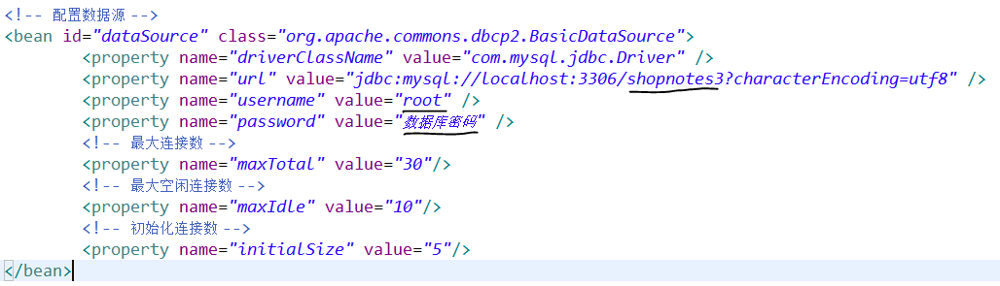
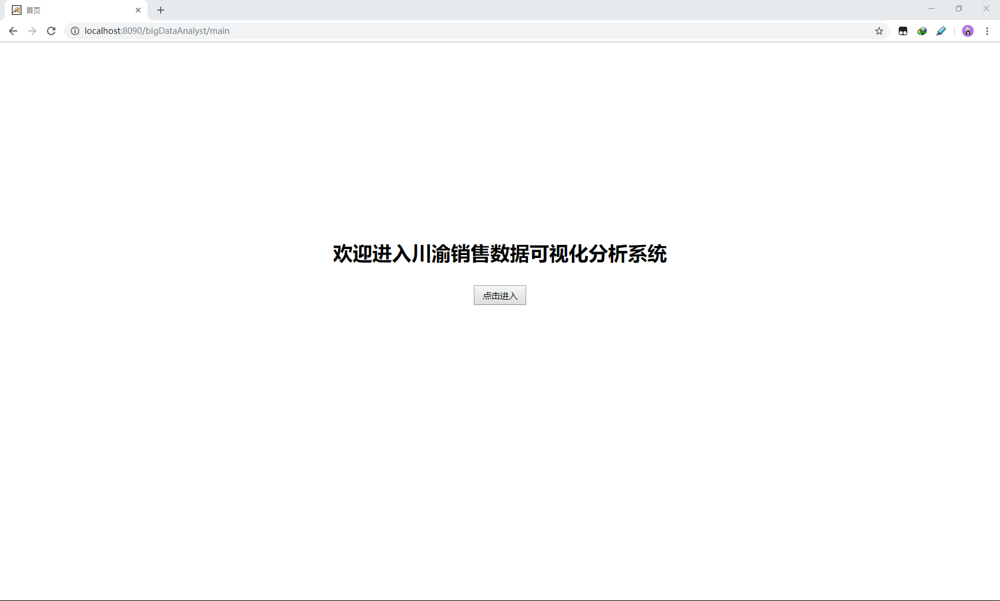
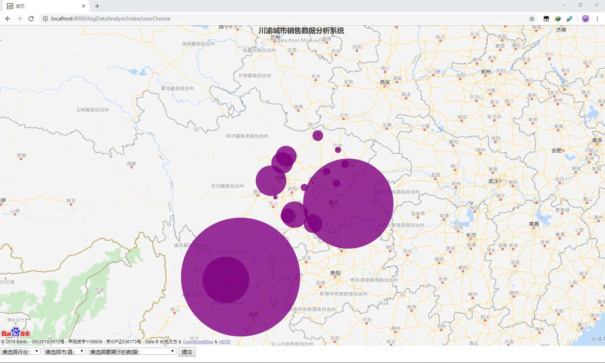
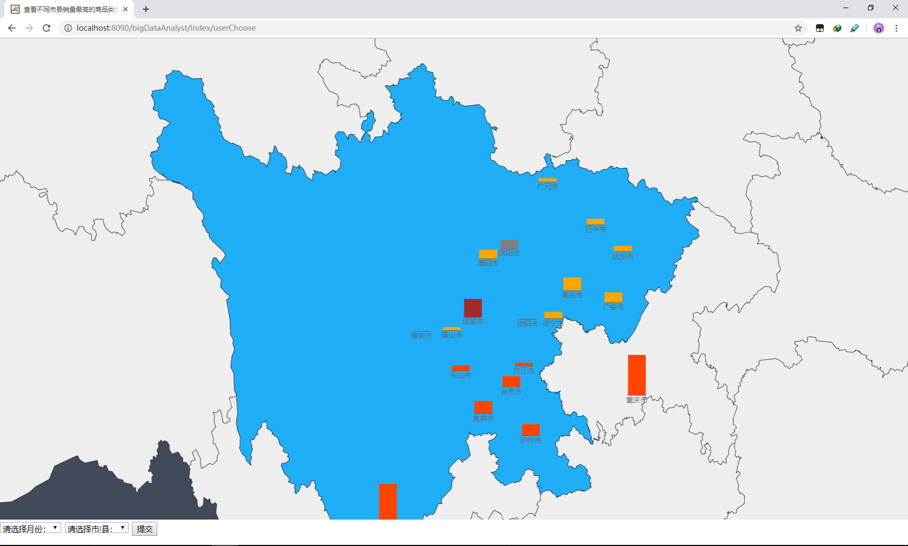

# 基于SSM的川渝销售数据可视化分析系统
--- 
> java版本：1.8
  spring版本：5.2
  开发工具：eclipse-JavaEE
  系统环境：Windows 10 专业版

### 使用步骤
---
1. 从[Github](https://github.com/shopAnalyst_SSM)上下载代码并导入到Eclipse中
2. 修改src目录下的application.xml配置文件，如图
3. 将项目添加到Tomcat服务器中，启动并运行

### 运行效果
---
1. 在浏览器中输入`localhost:8090/bigDataAnalyst/main`进入系统运行首页，如图
2. 在最底下的下拉框中选择“查看各地购买力活跃程度”，具体的效果如图
3. 在最底下的下拉框中选择“查看销量最高的商品类型”，具体的效果如图